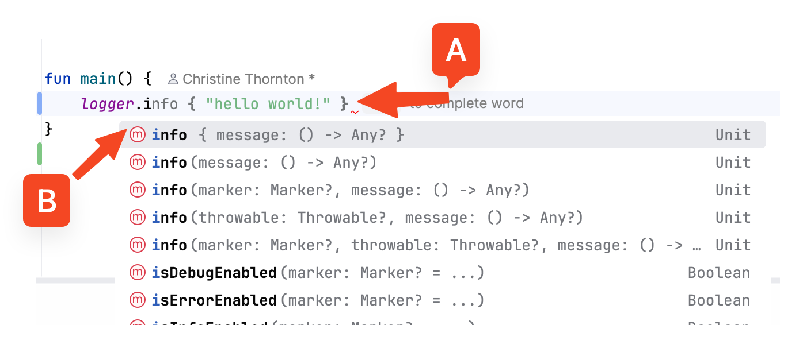

Interviewing Scratchpad
=======================
https://github.com/finallychristine/interviewing

This is an empty Kotlin repo with common libraries set up and ready to use for interviews that let me use my IDE locally.

This has some useful libraries ready to go as needed. Some are commented out in the [build.gradle](./build.gradle.kts)
file.

**Production Libraries**

* [Kotlin JSON Serialization](https://kotlinlang.org/api/kotlinx.serialization/kotlinx-serialization-json/kotlinx.serialization.json/-json/)
* [kotlin-logging](https://github.com/oshai/kotlin-logging)
* [rxjava](https://github.com/reactivex/rxjava)
* [okhttp](https://square.github.io/okhttp/)
* [guice](https://github.com/google/guice)

**Test Libraries**

* [Junit](https://junit.org/)
* [AssertJ](https://assertj.github.io/doc/)
* [Mockito](https://site.mockito.org/)

## AI Code Prediction
There are two types of code prediction Jetbrains supports:

* **A** -- AI code prediction -- can be [disabled in settings](docs/img/ai-autocomplete.png) 
* **B** -- Classic autocomplete

## Break on Exception
It's possible to break on any uncaught exception, [instructions here](docs/img/breakpoint-setup.png)
